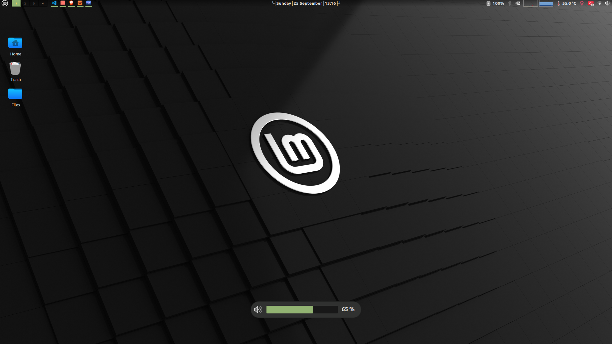
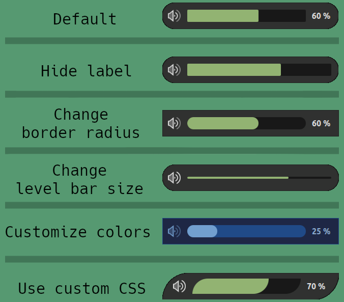

# Horizontal OSD

Make volume and brightness OSDs horizontal on your Cinnamon desktop environment. It's customizable so you can make your own OSDs too.

OSD Preview:



Alongside making your OSDs horizontal, there are lots of configuration options so you can customize OSDs as you want. Such as:
- Position, size, border-radius and hide timeout of osd window
- Size of icon, label and level bar
- border-radius of level bar
- Colors

Also you can write your custom CSS for all those elements.

Example custom OSDs:



## Installation

```
$ cd ~/.local/share/cinnamon/extensions/
$ git clone https://github.com/berk-karaal/cinnamon-horizontal-osd.git
$ ln -s ./cinnamon-horizontal-osd/horizontal-osd@berk-karaal/ .
```
Then, you can enable this extension from settings.